# Azure Networking Skeleton (Terraform)

Terraform-based Azure networking setup with:

- Private Linux VMs (no public IPs)
- Azure Bastion for SSH access
- NSGs attached at subnet level
- Application Security Groups (web/db separation)
- Subnet Flow Logs (v2)
- Log Analytics + KQL validation
- Full deploy → verify → destroy lifecycle

Region: westeurope

---

## Network Design Overview

Virtual Network: `10.0.0.0/16`

Subnets:

- `subnet-web` → 10.0.1.0/24 → `vm-web01`
- `subnet-db`  → 10.0.2.0/24 → `vm-db01`
- `AzureBastionSubnet` → 10.0.10.0/26 → Bastion

Design decisions:

- No VM has a Public IP
- SSH access only via Azure Bastion
- NSGs attached at subnet scope
- Explicit deny rules for SSH/RDP from non-Bastion sources
- App traffic rule: web → db on port 8080 (via ASGs)

---

## Observability Setup

Subnet Flow Logs (v2) enabled for:

- subnet-web
- subnet-db

Flow logs are sent to:

- Storage Account
- Traffic Analytics
- Log Analytics Workspace

Validation is performed using KQL queries in Log Analytics.

No raw JSON or CLI dumps are published in this repository.

---

## Validation Run – 2026-02-13

Screenshots are stored under:

`proofs/docs-proofs/run-2026-02-13_075327/screens/`

---

### 1) Deployment completed

Terraform apply completed successfully.

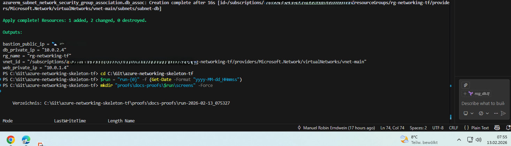

Resource Group overview:

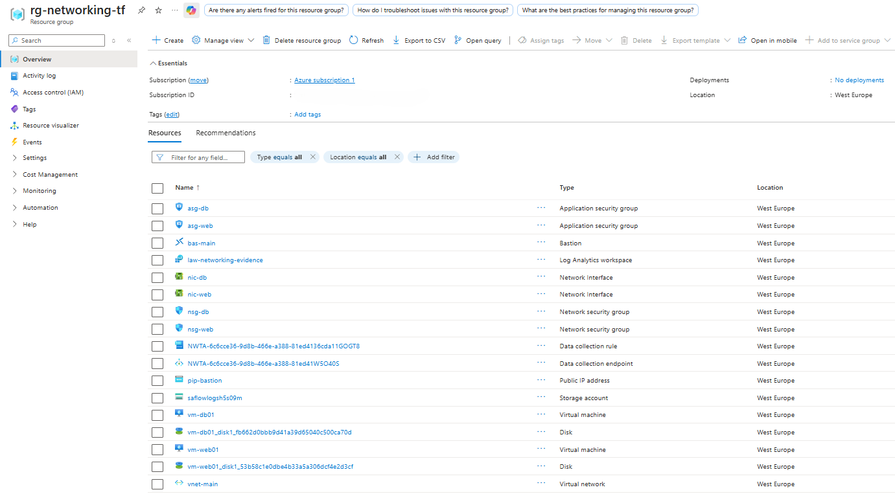

---

### 2) Bastion SSH access

Bastion used to access vm-web01.

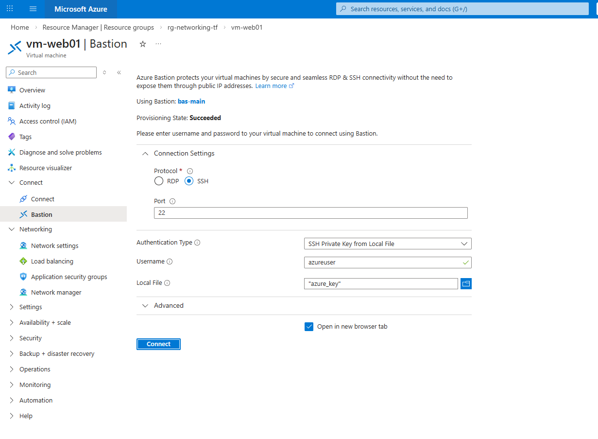

Hostname confirmation:

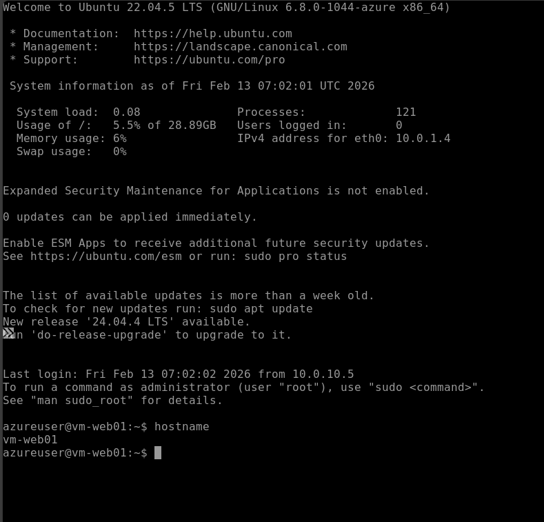

---

### 3) Allowed traffic test (8080)

Simple HTTP server running on db VM:

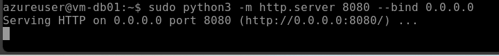

curl requests from web → db on port 8080:

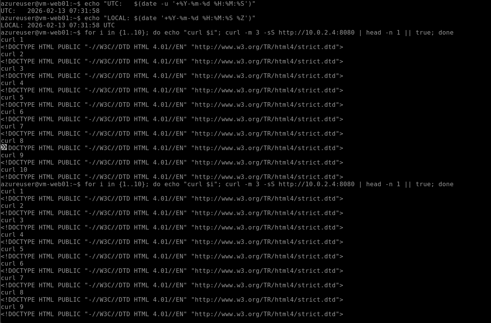

Expected result: traffic allowed by NSG rule.

---

### 4) Denied traffic test (3389)

nc connection attempts from web → db on port 3389:

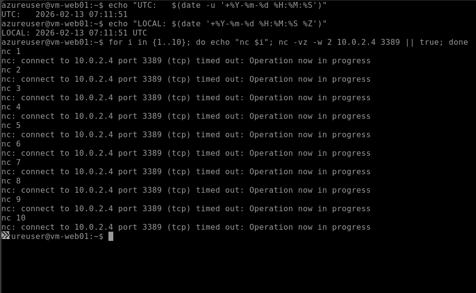

Expected result: inbound traffic denied by NSG rule.

---

### 5) Flow Logs enabled

Flow logs enabled on subnet-web:

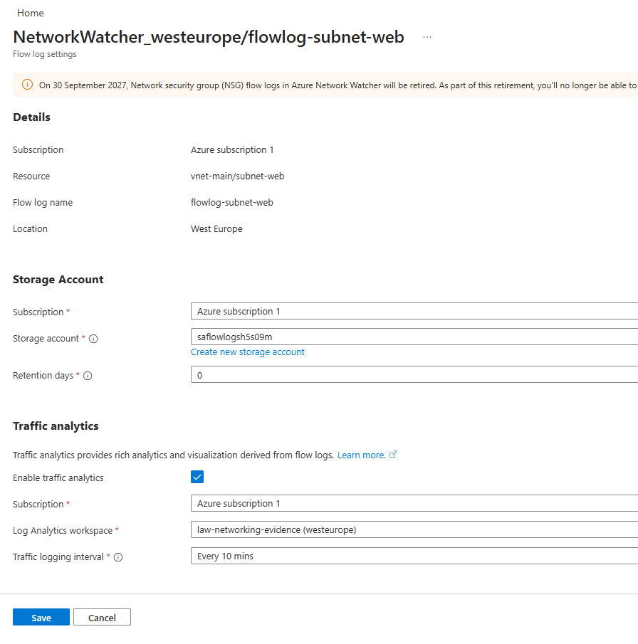

Flow logs enabled on subnet-db:

---

### 6) Log ingestion verified

Log Analytics query view:

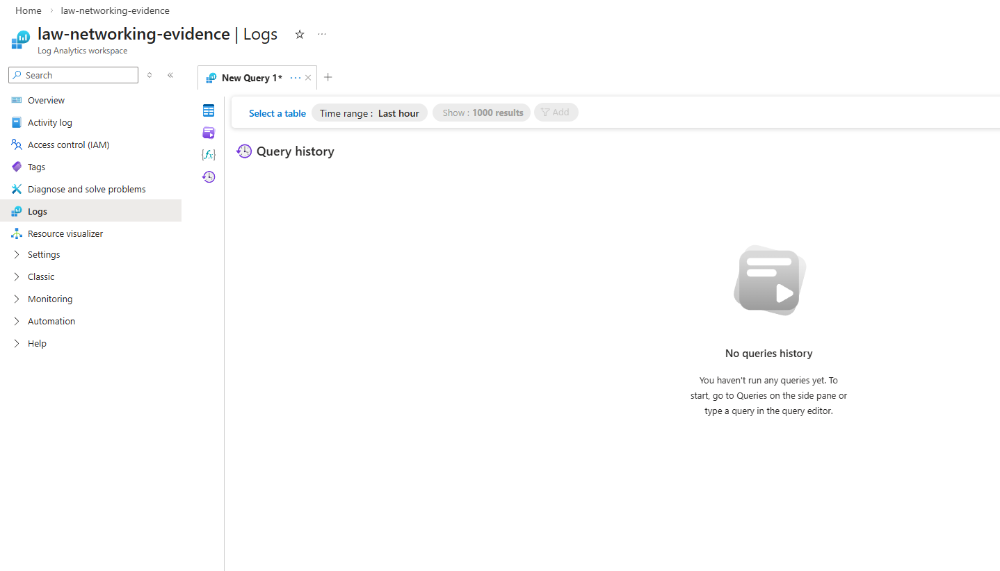

Sample NTA data:

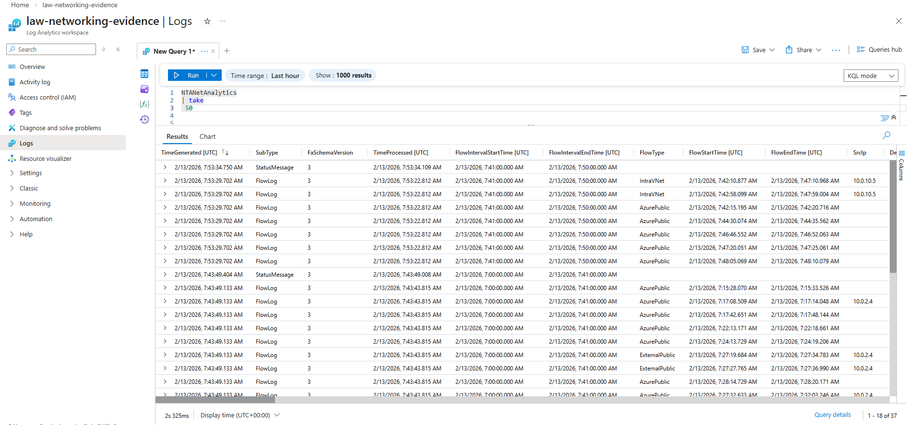

---

### 7) KQL validation

FlowStatus distribution:

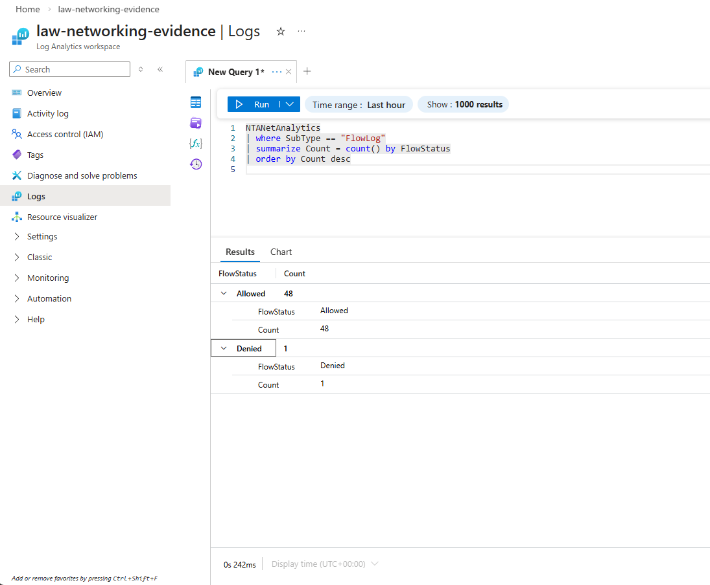

Allowed vs Denied summary:

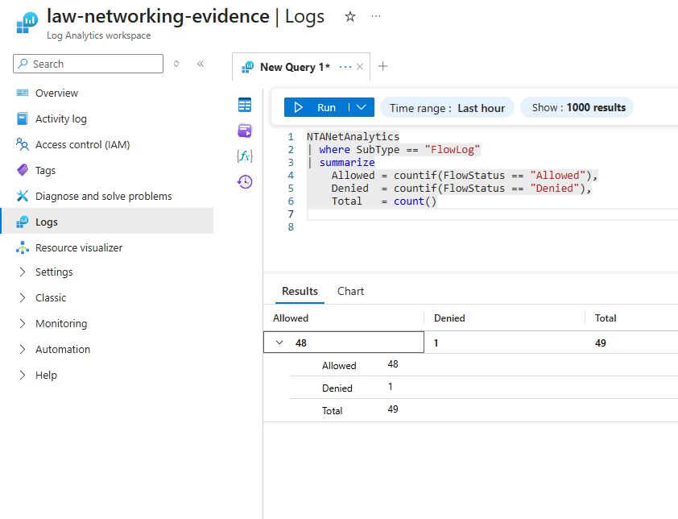

Port-level summary (8080 vs 3389):

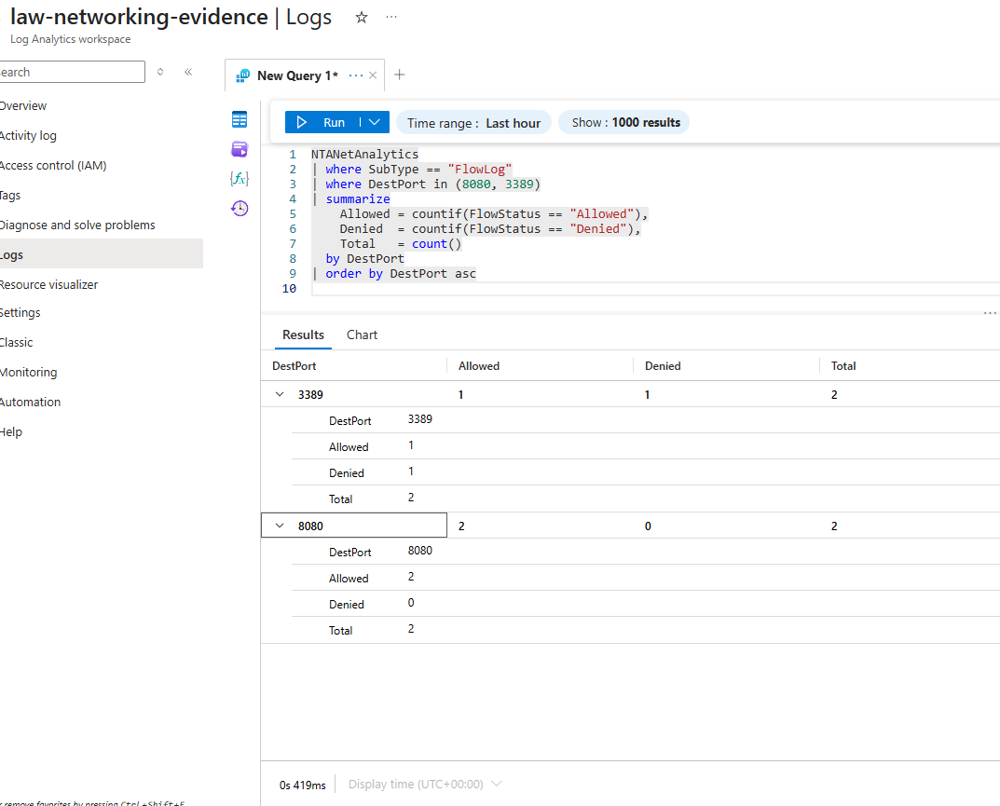

3389 direction detail:

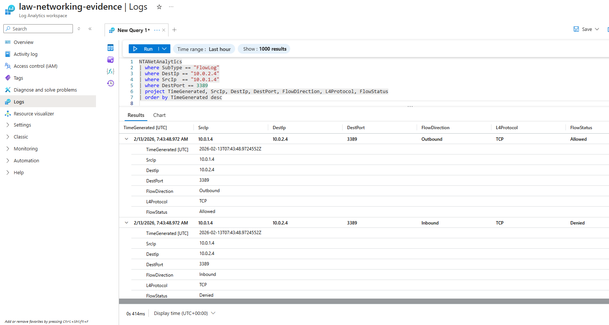

8080 direction detail:

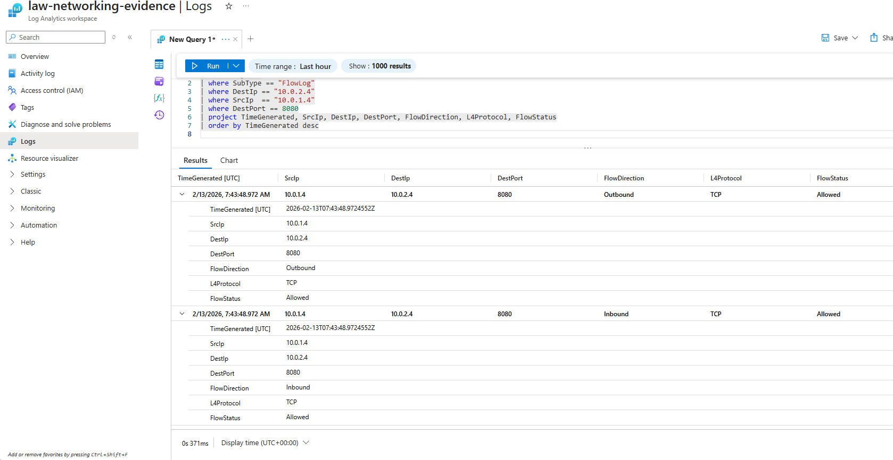

---

### 8) Cleanup

Environment destroyed using Terraform.

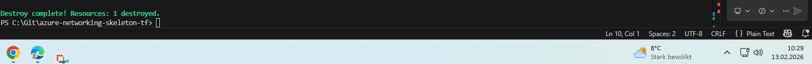

---

## Notes

- Raw Terraform/CLI outputs are not published.
- Manual redaction of JSON outputs was tested and discarded due to risk of incomplete sanitization.

---

## Evidence Strategy & Pivot

Initial approach:
- Terraform / Azure CLI JSON outputs
- Automated redaction via PowerShell script
- Publishing sanitized audit dumps

Issue:
- Regex-based redaction was not fully reliable.
- Sensitive fragments (e.g. SSH key material) could remain partially visible.
- Manual verification effort too high to guarantee safety.

Decision:
- No raw dumps are published.
- Only platform-generated evidence is used:
  - Azure Portal views
  - Flow Log configuration
  - Log Analytics (KQL) results

Rationale:
Security > completeness of raw output.
