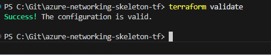
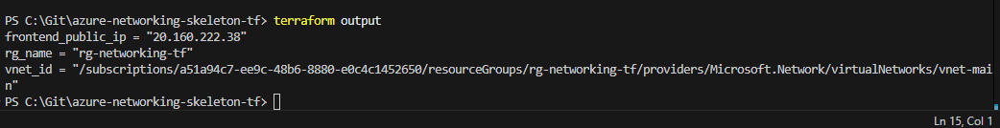
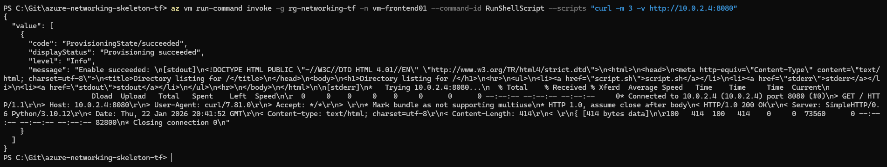

# azure-networking-skeleton-tf — v2 (ASG + NSG Hardening)

Two-tier Azure networking lab built with Terraform (AzureRM).
Goal: a practical network security baseline (private backend) with clean, reproducible proof artifacts.

---

## What it does

- Deploys a 2-tier VNet with frontend + backend subnets
- Deploys 2 Linux VMs:
  - frontend: has Public IP (SSH restricted to your IP)
  - backend: no Public IP (private-only)
- Uses Application Security Groups (ASGs) to lock down backend access:
  - asg-web (frontend NIC)
  - asg-db (backend NIC)
- Enforces backend rule: TCP 8080 allowed only from asg-web → asg-db

---

## Why this matters

- ASGs scale better than subnet-only rules (identity-based targeting via NIC membership).
- Backend stays private (no public exposure).
- You prove real connectivity over the private network (ASG/NSG path), not just “it deployed”.

---

## Components (names used in this repo)

### Network
- Resource Group: rg-networking-tf
- VNet: 10.0.0.0/16
- Subnets:
  - frontend (10.0.1.0/24)
  - backend (10.0.2.0/24)
  - AzureBastionSubnet (planned for v3)

### Compute
- VM frontend: vm-frontend01 (Public IP)
- VM backend: vm-backend01 (Private only)

### Security
- ASGs:
  - asg-web (frontend NIC)
  - asg-db (backend NIC)
- NSGs:
  - Frontend NSG: allow SSH 22 only from my_public_ip_cidr (/32)
  - Backend NSG: allow TCP 8080 only from asg-web → asg-db

---

## Terraform (IaC)

### Run order

    az login --use-device-code
    terraform init
    terraform fmt
    terraform validate
    terraform plan
    terraform apply
    terraform output

### Destroy (avoid costs)

    terraform destroy

---

## Configuration

Create a local terraform.tfvars (never commit it):

    copy terraform.tfvars.example terraform.tfvars
    notepad terraform.tfvars

Example:

    my_public_ip_cidr = "YOUR_PUBLIC_IP/32"

Tip: your public IP may change. Update terraform.tfvars and re-apply.

---

## Proof artifacts

### Truth run (latest clean full run)
- proofs/2026-01-22_210529/

### Curated proof (minimal screenshot set)
- proofs/cli/INDEX.md

Tip: In GitHub you can click the links. Images render inline.

---

## Evidence map (Step → Screenshot)

1) Terraform config validates
   - proofs/cli/00_terraform_validate.png

2) Outputs exist (public IP + RG + vnet id)
   - proofs/cli/01_terraform_output_all.png

3) Private IPs captured (frontend + backend)
   - proofs/cli/02_terraform_output_private_ips.png

4) Backend HTTP listener started on 8080
   - proofs/cli/03_backend_start_http8080.png

5) Backend is listening on 0.0.0.0:8080
   - proofs/cli/04_backend_listen_8080.png

6) Frontend reaches backend over private IP (HTTP 200 OK)
   - proofs/cli/05_frontend_to_backend_curl_8080.png

---

## Screenshots (inline)

**00 — terraform validate**
 

**01 — terraform output (public IP + RG + vnet id)**
 

**02 — terraform output (private IPs)**
 

**03 — backend start HTTP listener (8080)**
 

**04 — backend listens on 0.0.0.0:8080**
 

**05 — frontend → backend curl (HTTP 200 OK)**
 

---

## Lessons learned / pitfalls (real-world)

- ASG vs subnet rules: ASGs are cleaner at scale.
- Backend private-only: validate via frontend jump or az vm run-command (your method).
- Repo hygiene: never commit terraform.tfvars, *.tfstate*, .terraform/, SSH keys.

---

## Next (v3 — Bastion)

- Add Azure Bastion
- Remove public SSH exposure from frontend
- Optionally make frontend private-only as well
