# Azure Networking Skeleton (Terraform)

Terraform-based Azure hub-and-spoke networking lab with:

- Dedicated hub plus application and data spokes
- Azure Bastion as a shared management service in the hub
- Linux NVA with IP forwarding for spoke-to-spoke transit
- UDRs that force application/data traffic through the NVA
- Private Linux VMs with no public IP addresses
- Subnet-level NSGs and App/Data Application Security Groups
- Microsoft Entra SSH login with explicit RBAC assignment
- Subnet Flow Logs v2, Traffic Analytics and Log Analytics
- Dedicated Azure Blob backend with state locking and RBAC
- Full deploy, validate and destroy lifecycle

Region: `westeurope`

---

## Current Architecture

> [!NOTE]
> This repository is a portfolio and learning environment, not a complete production landing zone. The architecture demonstrates separation of concerns, controlled transit, shared services and repeatable Infrastructure as Code.

### Address spaces

| Network | Address space | Purpose |
|---|---:|---|
| `vnet-hub` | `10.0.0.0/16` | Shared services, Bastion and NVA |
| `vnet-spoke-app` | `10.10.0.0/16` | Application workload |
| `vnet-spoke-data` | `10.20.0.0/16` | Data workload |

### Subnets

| Subnet | Prefix | Workload |
|---|---:|---|
| `AzureBastionSubnet` | `10.0.0.0/26` | Azure Bastion |
| `snet-nva` | `10.0.1.0/24` | `vm-nva01` |
| `snet-app` | `10.10.1.0/24` | `vm-web01` |
| `snet-data` | `10.20.1.0/24` | `vm-db01` |

### Traffic and security design

- Hub-to-spoke and spoke-to-hub peerings allow forwarded traffic.
- UDRs send app-to-data and data-to-app traffic to the NVA private IP.
- IP forwarding is enabled on the NVA NIC and inside the Linux guest.
- SSH is allowed only from `AzureBastionSubnet`; lower-priority rules deny SSH from other sources.
- Application traffic to the data workload is limited to TCP/8080 using `asg-app` as source and `asg-data` as destination.
- No workload VM has a public IP address.
- Microsoft Entra SSH access is assigned to the explicit `vm_admin_principal_id`; it is not implicitly tied to the identity running Terraform.

---

## Observability Setup

Subnet Flow Logs v2 are enabled for:

- `snet-app`
- `snet-data`

Flow logs are written to a dedicated workload storage account and connected to Traffic Analytics and Log Analytics. KQL can be used to validate allowed and denied flows.

No raw JSON, state files or CLI dumps are published in this repository.

---

## Historical Validation Run – 2026-02-13

> [!IMPORTANT]
> The screenshots below document the earlier v1.0 single-VNet validation run. The current code has since evolved to the hub-and-spoke architecture described above.

Screenshots are stored under:

`proofs/docs-proofs/run-2026-02-13_075327/screens/`

---

### 1) Deployment completed

Terraform apply completed successfully.

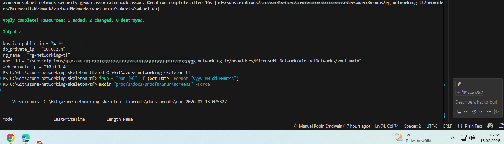

Resource Group overview:

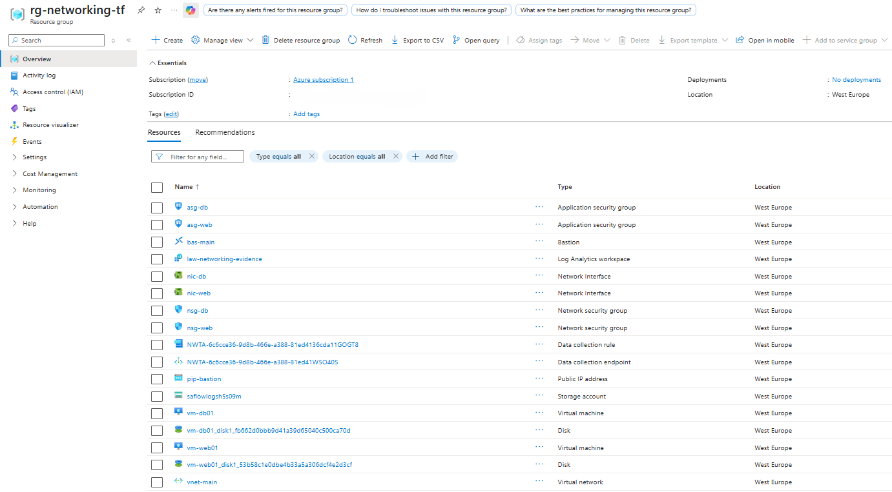

---

### 2) Bastion SSH access

Bastion used to access vm-web01.

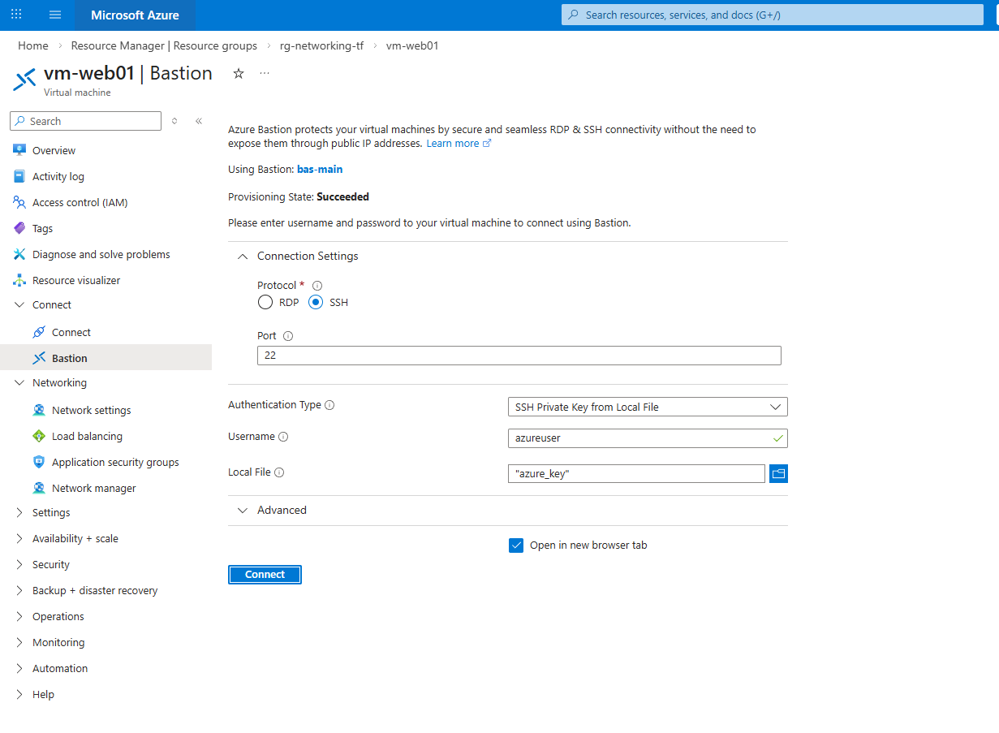

Hostname confirmation:

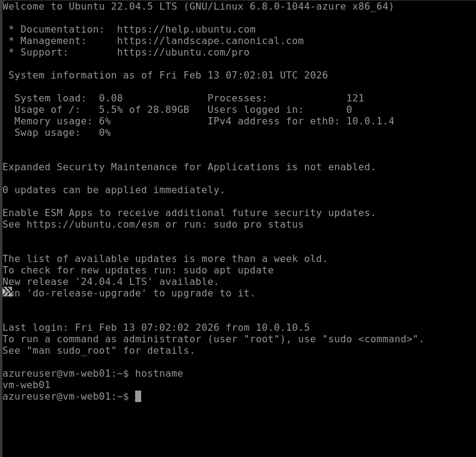

---

### 3) Allowed traffic test (8080)

Simple HTTP server running on db VM:

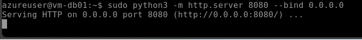

curl requests from web → db on port 8080:

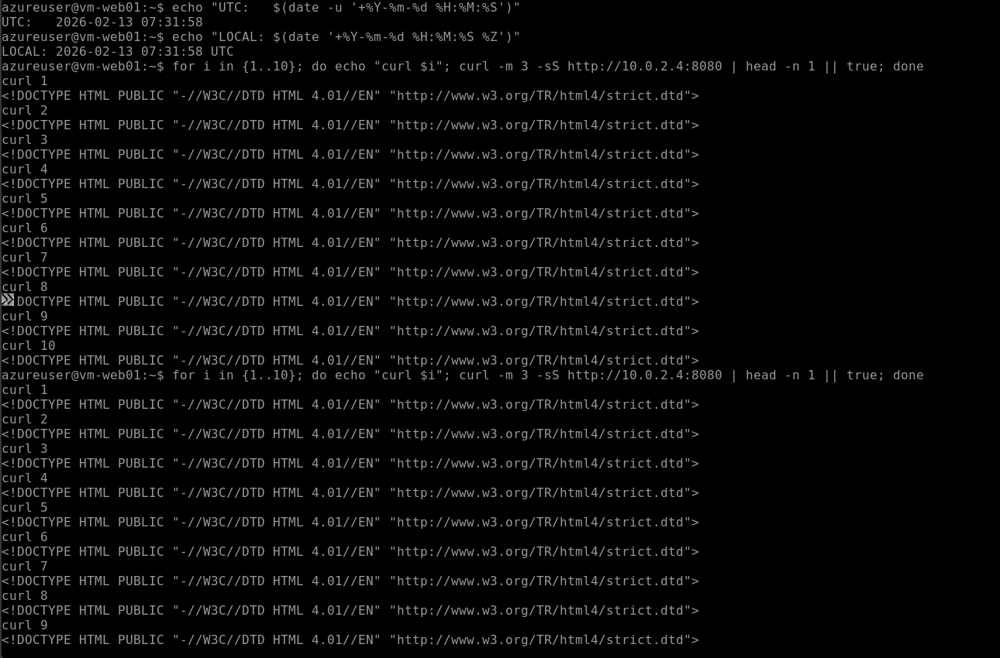

Expected result: traffic allowed by NSG rule.

---

### 4) Denied traffic test (3389)

nc connection attempts from web → db on port 3389:

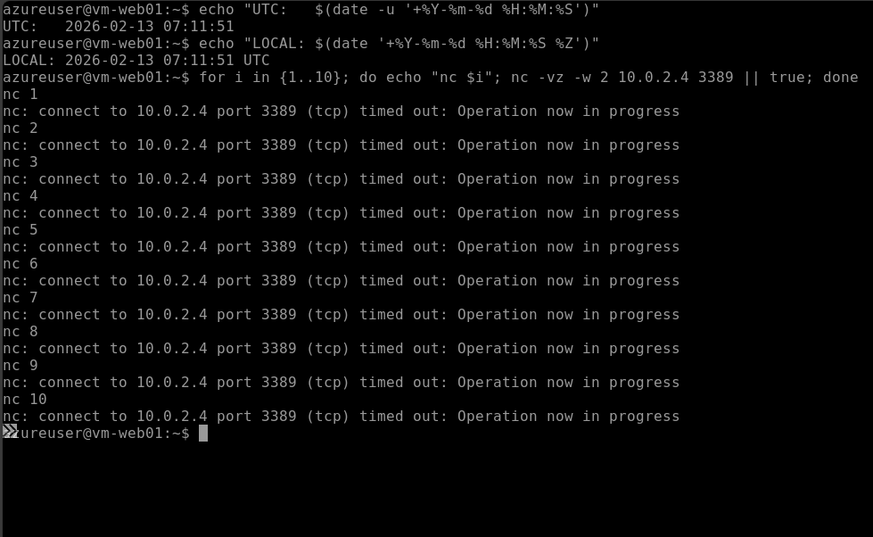

Expected result: inbound traffic denied by NSG rule.

---

### 5) Flow Logs enabled

Flow logs enabled on subnet-web:

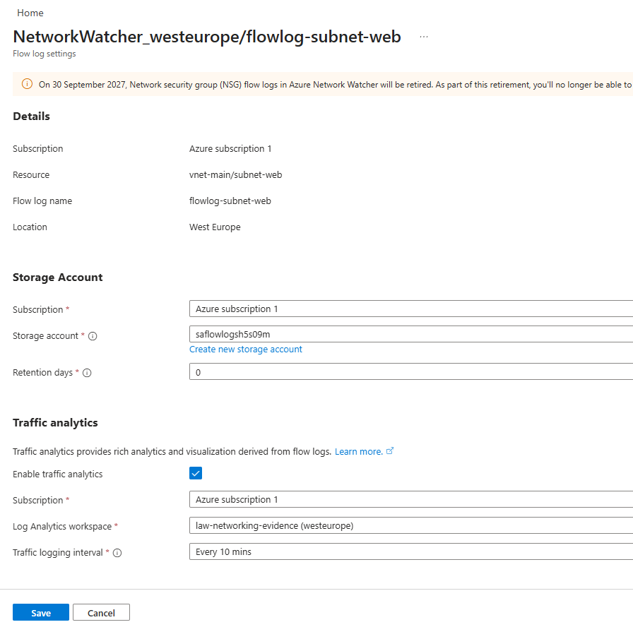

Flow logs enabled on subnet-db:

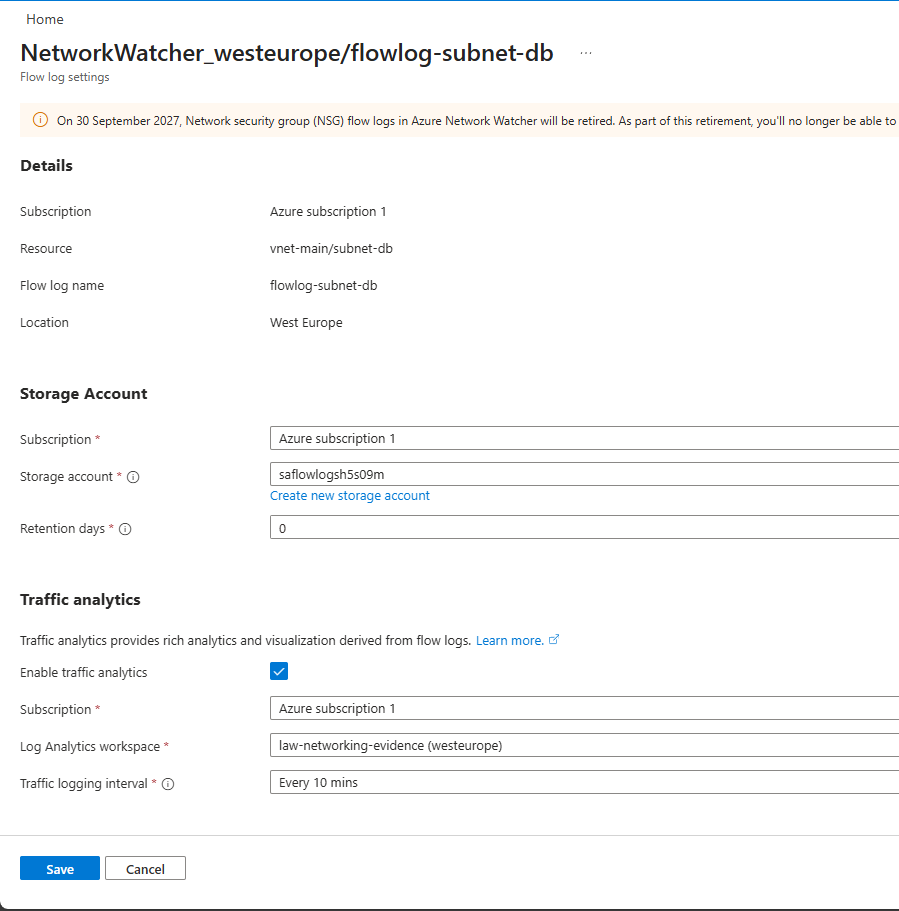

---

### 6) Log ingestion verified

Log Analytics query view:

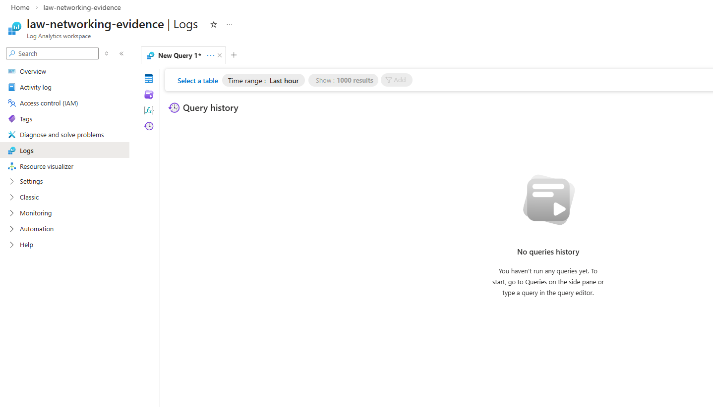

Sample NTA data:

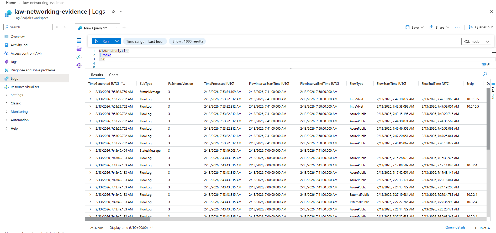

---

### 7) KQL validation

FlowStatus distribution:

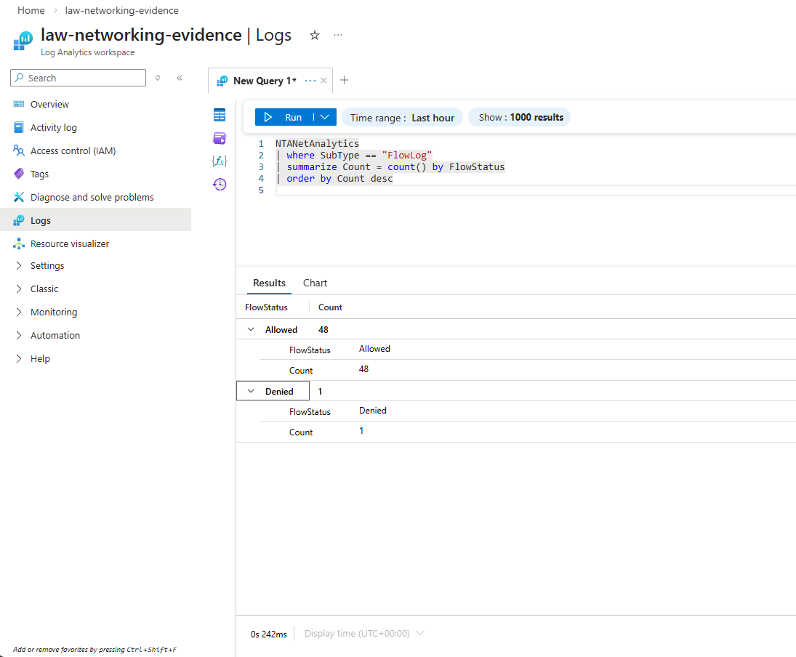

Allowed vs Denied summary:

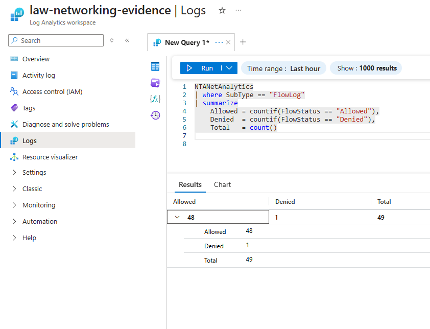

Port-level summary (8080 vs 3389):

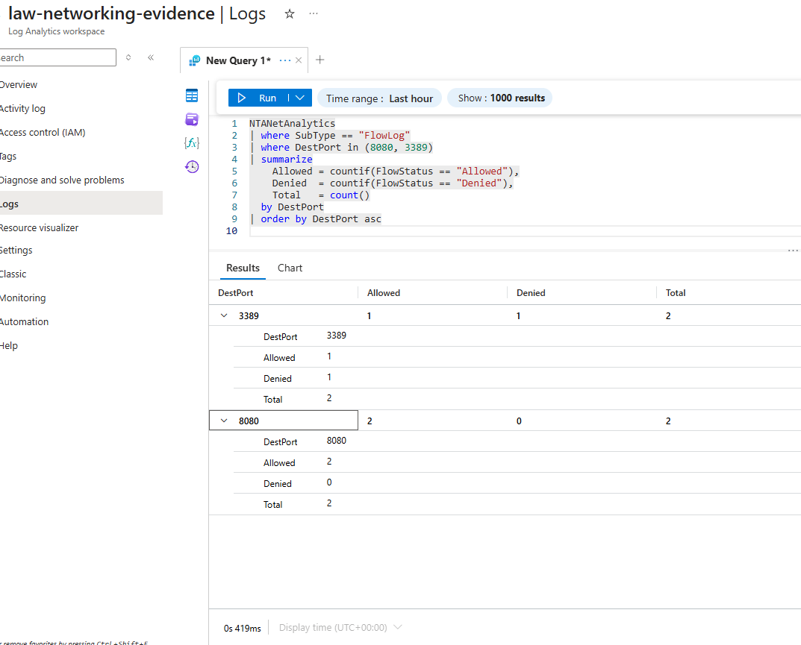

3389 direction detail:

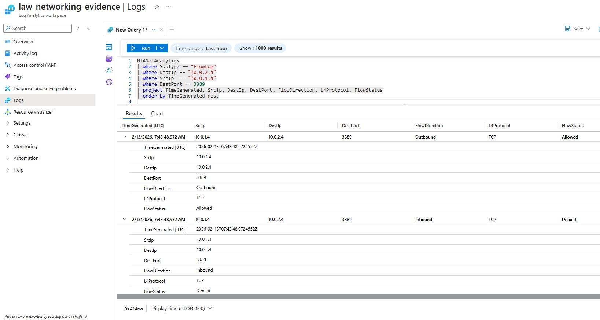

8080 direction detail:

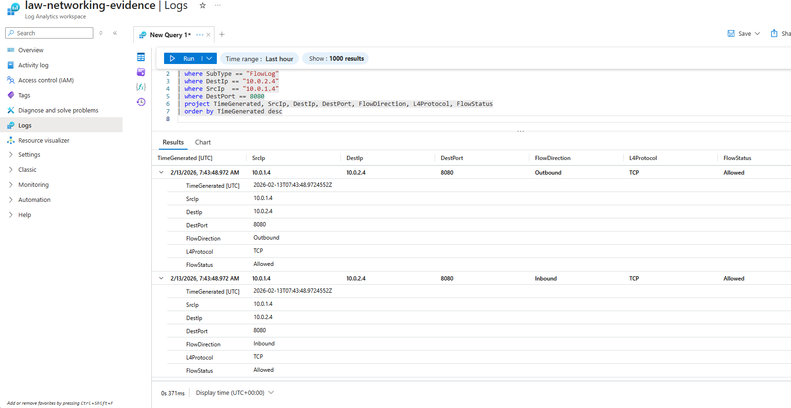

---

### 8) Cleanup

Environment destroyed using Terraform.

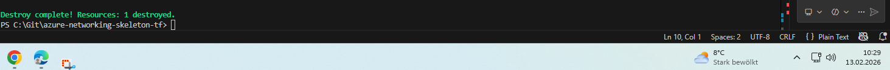

---

## Notes

- Raw Terraform/CLI outputs are not published.
- Manual redaction of JSON outputs was tested and discarded due to risk of incomplete sanitization.

---

## Evidence Strategy & Pivot

Initial approach:
- Terraform / Azure CLI JSON outputs
- Automated redaction via PowerShell script
- Publishing sanitized audit dumps

Issue:
- Regex-based redaction was not fully reliable.
- Sensitive fragments (e.g. SSH key material) could remain partially visible.
- Manual verification effort too high to guarantee safety.

Decision:
- No raw dumps are published.
- Only platform-generated evidence is used:
  - Azure Portal views
  - Flow Log configuration
  - Log Analytics (KQL) results

---

## Roadmap & Milestones

Legend:
- ✅ Completed
- 🔄 In Progress
- ⏳ Planned

### v1.0 — Networking + Observability Evidence

Status: ✅ Completed

Scope:
- Private Linux VMs
- Azure Bastion
- NSGs and ASGs
- Subnet Flow Logs v2, Log Analytics and KQL validation
- Full deploy, verify and destroy lifecycle

Evidence:
- Historical screenshots referenced above

---

### v1.1 — Remote Terraform State + Hub-Spoke Refactor

Status: ✅ Completed

Implemented:
- Dedicated bootstrap stack for the backend resource group, storage account and private container
- Azure Blob backend with lease-based state locking
- Azure AD authentication and RBAC-based blob access
- Separation between backend infrastructure and workload infrastructure
- Hub-and-spoke topology with shared Bastion and NVA
- Bidirectional peerings with forwarded traffic
- UDRs and virtual-appliance next hops
- Explicit identity variables for stable RBAC ownership
- Successful full workload destroy while retaining the remote backend

---

### v1.2 — CI/CD + DevSecOps (GitHub Actions, OIDC and Checkov)

Status: 🔄 In Progress

Planned:
- `terraform fmt -check -recursive` and `terraform validate` on push and pull requests
- Checkov static analysis as a blocking security gate
- Secretless GitHub-to-Azure authentication through OIDC
- Terraform plan on pull requests
- Manual apply through `workflow_dispatch`
- GitHub Environment approval before apply
- Minimal Azure RBAC at the required scope
- Separate plan and apply jobs

Technical focus:
- Secretless authentication
- Stable, explicitly configured deployment identities
- Controlled deployment flow
- Reproducible CI execution
- Documented handling of justified lab exceptions
